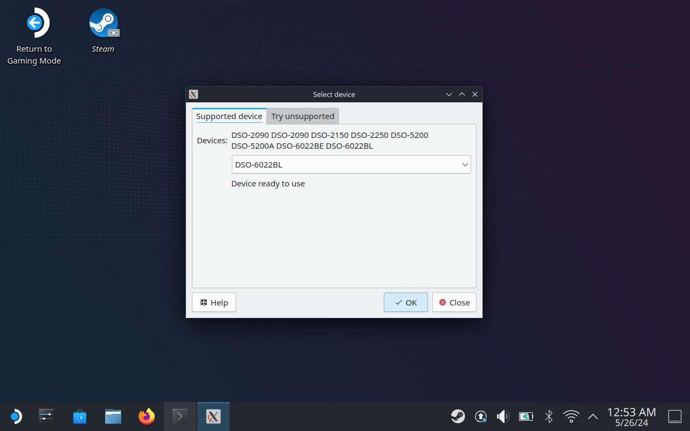
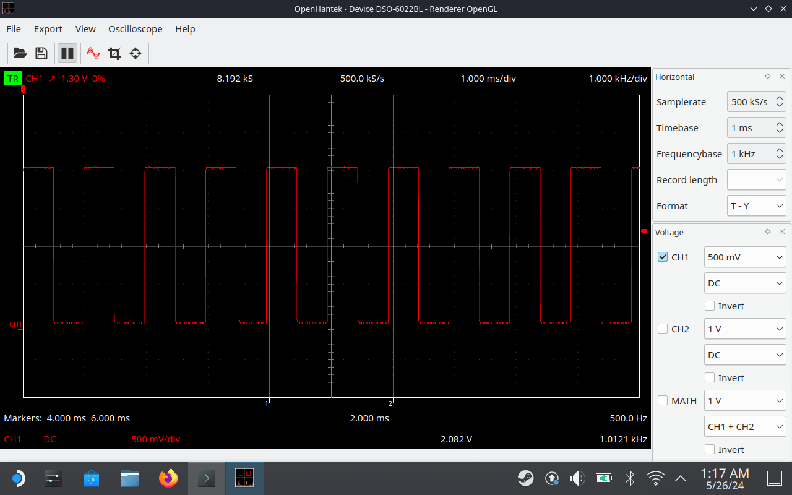

# Build OpenHantek for Steam Deck

Tools to build [OpenHantek](https://github.com/openhantek/openhantek) for the [Steam Deck](https://store.steampowered.com/steamdeck)

## Pre-requisites

* docker
* make

## How to build

TL;DR:

```shell
git clone --recursive https://github.com/eagafonov/openhantek-steamdeck.git
cd openhantek-steamdeck
make
make run-package send-to-steamdeck
```

## Screenshots

Select device





# TODOs

* [ ] Find a better base docker image.
* [ ] Deal with udev rules to run as a user.
* [ ] Package for Steam mode
